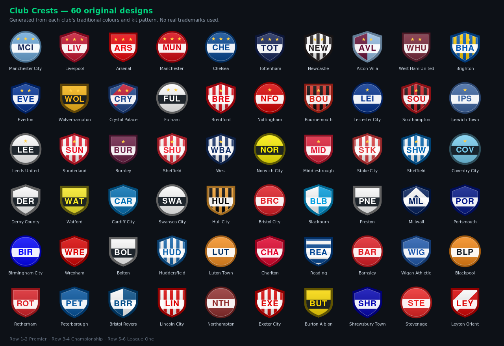

# 足球经理 · Football Manager Web

浏览器里的足球经理模拟游戏。**单文件、零依赖、不联网、手机可装**。

👉 **在线试玩：** https://Lynch715.github.io/football-manager-web/

## 玩什么

- **三级联赛 60 家俱乐部**（英超 / 英冠 / 英甲），每队 25–30 名球员，全部程序生成
- **回合制比赛引擎**：持球人依据自身属性、场上位置与防守压力，在传球 / 过人 / 传中 / 射门间做选择；越位、犯规、红黄牌、伤病、体能衰减实时结算
- **2D 俯视球场**：22 人按阵型与球的位置动态跑位，逐帧插值渲染，0.5×–8× 变速，随时换人与临场改战术
- **8 套阵型 + 4 条战术指令**（心态 / 节奏 / 逼抢 / 宽度），引擎真实读取这些数值
- **完整赛季循环**：38 轮联赛 + 6 轮足总杯，3 升 3 降含附加赛，多赛季存档
- **经营系统**：转会窗与球探情报、周训练重点、青训梯队、合同续约、工资与转会预算、董事会信心

## 引擎校准

按真实英超数据调参，500 场压力测试：

| 指标 | 本引擎 | 英超实际 |
|---|---|---|
| 场均进球 | 2.78 | ~2.8 |
| 射门 / 射正 | 27.4 / 10.1 | ~26 / 8.7 |
| 犯规 / 黄牌 | 18.3 / 3.0 | ~20 / 3.5 |
| 全场传球 | 922 | ~900 |

6 个赛季长跑下球员总量、年龄结构、能力分布与俱乐部财政均不发散。

## 手机

- 横屏优先，竖屏自动切底部导航 + 单栏布局，表格可横向滑动
- 支持「添加到主屏幕」，全屏运行、**断网也能玩**（Service Worker 离线缓存）

## 存档

进度不会自动保存。在「存档」页手动保存到浏览器，或导出 `.json` 文件长期保留。

## 队徽

60 枚队徽是按各队传统队色与球衣版式（竖条 / 横环 / 分色 / 斜带 / 四分格）自绘的**原创 SVG**，
不使用任何真实俱乐部商标。想换成自己的图片，进「队徽」页单张更换或批量拖入即可，
文件名含球队英文名 / 中文名 / 简称就能自动匹配。替换后的图片只存在你本机浏览器里。

## 本地运行

不需要服务器，直接双击 `index.html` 即可（离线缓存与主屏安装功能需通过 http(s) 访问）。

## 许可

MIT。俱乐部名称与球场名为真实存在的事实性信息，球员、数据、队徽均为虚构或原创。
